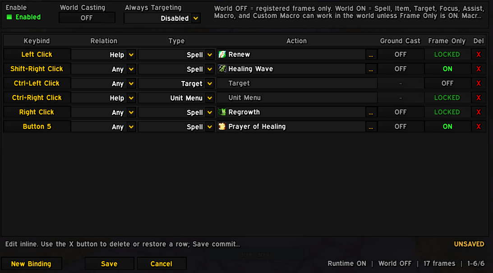
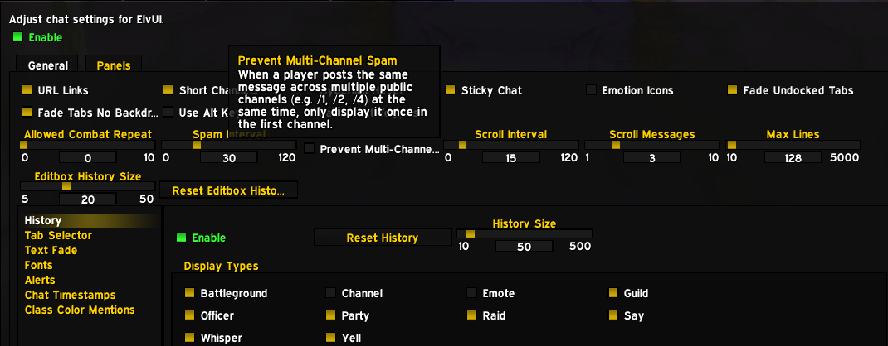
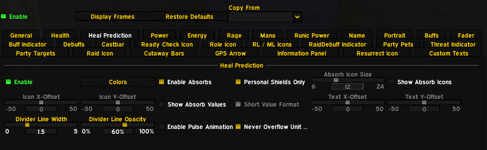
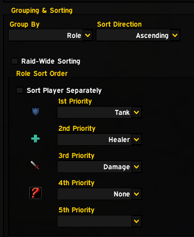
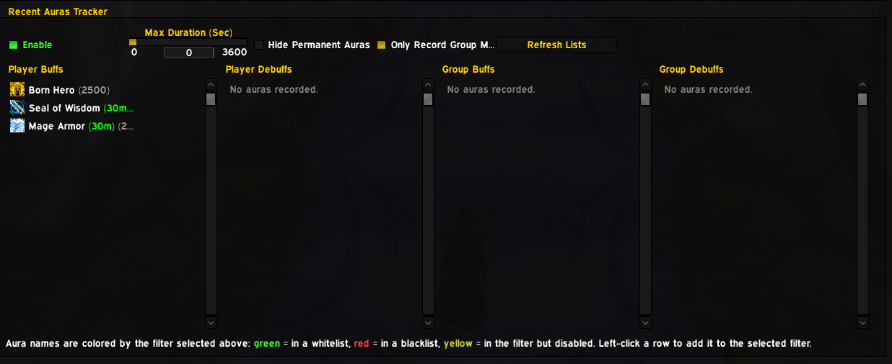

# ElvUI-Grimfall

  

A fork of **ElvUI (WotLK 3.3.5a)** adapted for classless private servers, packed with the best quality-of-life features ported from the Ascension/Krysio forks plus the **ClickCast** addon.

On classless servers like **Grimfall WoW** every character is flagged as `DRUID` regardless of the abilities they use, which breaks ElvUI's class-based features. This fork adapts ElvUI to that environment and brings modern, advanced modules on top of it.

---

## ✨ Features

### 🖱️ ClickCast
Click-to-cast with secure action buttons: bind spells to right/middle clicks on unit frames, action bars, nameplates or the UI itself. Fully configurable, cast-sequence support, and deadzone control so you never misclick.

<!-- 📸 Screenshot ready: replace the src below with your ClickCast screenshot URL -->

  

### 🎣 Customizable Loot Roll Window
Personalize the loot roll frame: width, height, font family/size, outline, backdrop transparency and background color, with a built-in **Preview Loot Roll** button so you can see the result before it ever matters.

### ✉️ Cross-Channel Spam Filter & Fast URL Detection
Smart cross-channel message deduplication blocks duplicated spam across every chat channel, while a fast URL checker exits instantly unless links (`://`, `www.`, `@`) are actually present. Toggle it from the chat options.

<!-- 📸 Screenshot ready: replace the src below with your Spam Filter screenshot URL -->

  

### 🛡️ Enhanced Threat Indicator
Upgraded threat and mob aggro display for Unit Frames — Party, Raid, Target and Player — showing the exact number of mobs targeting you, dynamic threat glow borders and per-unit configurable threat state thresholds.

### 🎨 Custom Power Bar Color
Dedicated **Custom Color** toggle and RGB picker for Power bars on Pet and Unit Frames, so you can color each power bar independently of the class defaults.

### 🛡️ Absorb Shields Engine
A redesigned shared absorb-detection engine for Unit Frames and Nameplates: whitelist-first filtering (native WotLK shields included), heal prediction options, raid combat throttling and a massive reduction in API calls so raids stay smooth.

<!-- 📸 Screenshot ready: replace the src below with your Absorb Engine screenshot URL -->

  

### 🧙 Spec Detection & RDF Role Sorting
Automatic background spec inspection detects every Grimfall/Ascension support setup and assigns **Support** role icons in group frames and RDF. Replaces unstable hooks with a deterministic namelist sorter (`TANK`, `HEALER`, `DAMAGER`, `SUPPORT`) — no more mid-combat frame swapping.

<!-- 📸 Screenshot ready: replace the src below with your Spec Detection screenshot URL -->

  

### 🔎 Recent Auras Tracker
The **Recent Auras** filter tracks buffs and debuffs applied on your character in real time, color-coded (green / red / yellow), so you can left-click them to instantly add them to your custom filters.

<!-- 📸 Screenshot ready: replace the src below with your Recent Aura Tracker screenshot URL -->

  

### 📣 Quest Announce Module
Announce quest progress (earned XP, completed, accepted, etc.) to party or raid with configurable frequency and debug logging. Location: `General` ➔ `Quest Announce`.

### 🧟 Always-on Death Knight Runes
The rune bar is built for every character with no class detection (since the server reports everyone as `DRUID`). It defaults to the top of the Player unit frame and shows the full 6-rune resource, with its own config section under `Unit Frames` ➔ `Player`. *(Grimfall server feature — by Valdstein.)*

---

## ⚡ Performance Optimizations

- **Range fader fixes** — corrected range-check logic that was burning thousands of API calls per second in 40-man raids.
- **Lazy chat deduplication** — spam filtering skips heavy work unless duplicate content is actually detected.
- **Bag refresh deferral** — item refresh work deferred until the frame settles, no more per-event stalls.
- **Tag & cooldown caches** — smarter cache invalidation for status tags and cooldown data.

---

## 🛠️ Bug Fixes & Refinements

- **Core.lua safety guard** — fixed invalid access to `WipeUnitRoleCache` so the role-sorting module initializes cleanly.
- **Absorb separator rendering** — corrected the separator color call (`SetVertexColor`) for clean shield bar visuals.
- Version string and TOC notes mark the build as the Grimfall fork.

---

## 📦 Included addons

ElvUI core plus the following companion plugins: AddOnSkins, AuraBarsMovers, BagControl, CastBarOverlay, CustomTags, CustomTweaks, DataTextColors, DTBars2, Enhanced, EnhancedFriendsList, ExtraActionBars, OptionsUI, RaidMarkers, SwingBar — and the included **ClickCast** addon.

## 📥 Installation

Clone or download into your WoW `Interface\AddOns` directory so each `ElvUI*` folder sits directly under `AddOns`.

## 🧑‍🤝‍🧑 Credits

- **ElvUI** — by Elv, Bunny and the ElvUI-WotLK community.
- **Feature development** — all bundled features above (except ClickCast) are authored by **Rhenyra** (Ascension/Krysio edition).
- **ClickCast** — by **Vupp**, with enhancements and adaptations by **Krysio**.
- **Global porting & integration** — fork maintenance, classless adaptations and feature porting by **Krysio**.
- **Grimfall-specific work** — DK rune implementation for the Grimfall server by **Valdstein**.

---

_Maintained by **Krysio**._